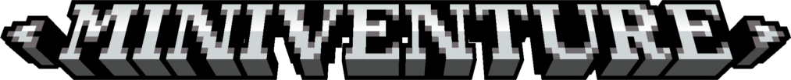

# MiniVenture 🕹️

MiniVenture is a premium isometric voxel engine built from scratch using **Java** and **LWJGL 3**. It features a procedurally generated world, dynamic lighting, and a smooth gameplay experience.



## ✨ Features

- **Infinite World**: Procedural chunk-based generation using Perlin Noise.
- **Dynamic Day/Night Cycle**: Real-time lighting transitions and atmosphere changes.
- **Voxel Interaction**: Break and place blocks with precision ray-casting.
- **Advanced Rendering**: Optimized isometric view with custom shaders and texture mapping.
- **In-game Chat & UI**: Functional chat system and a glassmorphic settings menu.
- **Performance Settings**: Adjustable render distance, shading quality, and progressive loading.

## 🎮 Controls

| Key | Action |
|-----|--------|
| **W, A, S, D** | Move Player |
| **Space** | Jump |
| **LMB** (Left Click) | Break Block |
| **RMB** (Right Click) | Place Block |
| **1 - 9** | Select Hotbar Slot |
| **T** | Open Chat |
| **ESC** | Open Settings / Close UI |
| **C + Scroll** | Zoom In/Out |

## 🛠️ Technical Stack

- **Language**: Java
- **Graphics API**: OpenGL 3.3 (Core Profile)
- **Framework**: [LWJGL 3](https://www.lwjgl.org/)
- **Math Library**: [JOML](https://github.com/JOML-CI/JOML)
- **Noise**: Custom Perlin Noise implementation

## 🚀 How to Run

### Prerequisites
- Java Development Kit (JDK) 17 or higher.

### Quick Run (macOS & Linux)
Open your terminal and run:
```bash
chmod +x run_game.sh
./run_game.sh
```

### Quick Run (Windows)
Just double-click **`run_game.bat`** or run it from the Command Prompt:
```cmd
run_game.bat
```

### Manual Compilation
If you prefer compiling manually:
```bash
# macOS/Linux:
javac -d bin -cp "lib/*" $(find src -name "*.java")
java -XstartOnFirstThread --enable-native-access=ALL-UNNAMED -cp "bin:lib/*" com.miniv.core.Main

# Windows (Command Prompt):
dir /s /B src\*.java > sources.txt
javac -d bin -cp "lib/*" @sources.txt
del sources.txt
java --enable-native-access=ALL-UNNAMED -cp "bin;lib/*" com.miniv.core.Main
```

## 📂 Project Structure
- `src/`: Java source files.
- `assets/`: Textures and shaders.
- `lib/`: Pre-packaged LWJGL and JOML libraries.
- `run_game.sh` / `run_game.bat`: Quick launch scripts.

---
Developed by **alanthecoderishere**